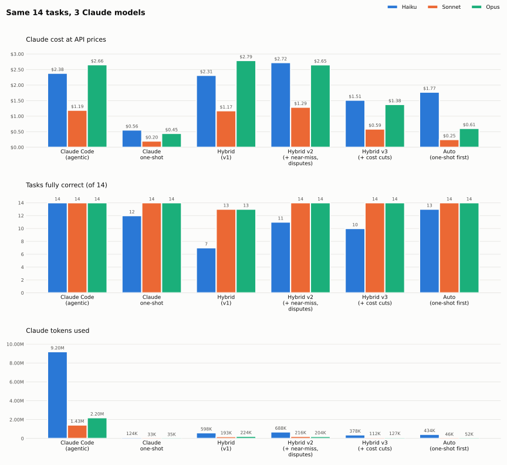

# claude-local-evolve

Free local LLMs (via [Ollama](https://ollama.com)) do the bulk writing in a Darwinian evolution loop: several
models write competing attempts in parallel "threads", tests score them, weak threads get pruned, strong ones
mutate and crossbreed. Claude (via [Claude Code](https://claude.com/claude-code)) only plans, reviews the threads
(kill / keep / refine / fork) and judges the winner, so a typical task costs 1–5 short Claude calls.

It adapts to the computer it runs on: `hardware.py` detects memory and GPU and picks models, parallelism and
context sizes that fit, from an 8 GB laptop to a 64 GB+ workstation.

```
task ─► small change? Claude writes it + a few tests in one lean call; passes → done  (1 call)
     ─► otherwise / if that fails: Claude writes spec + compact visible and hidden tests (1 call)
     ─► N threads, each owned by a local model from this machine's profile
     ─► every round, all local and free:
          mutate   each thread's fittest attempt, with its own test failures fed back
          cross    two threads passing DIFFERENT tests → one child merges them
          score    pytest, each candidate in its own git worktree
          select   thread keeps its fittest · identical threads dropped ·
                   no progress for 2 rounds → pruned, a fresh thread takes its place
     ─► when the run stalls, Claude reads a compact digest of all threads     (1 call each)
          keep · kill (dead end) · refine (pointed hint) · fork (clone onto another model)
     ─► a thread stuck 1–2 tests from passing? early review; Claude may send a ≤25-line code snippet
     ─► visible-test passers must also pass hidden tests (catches test-gaming)
          fails hidden but passes visible? Claude referees: fix wrong hidden tests, or hint the bug
     ─► finalists verified by hidden tests → smallest change wins (Claude judges only without hidden tests)
     ─► winner + tests written into your working tree; you review with git diff
```

## What's inside

| File | What it does |
|---|---|
| `evolve.py` | The coding loop above. Fitness = pytest. |
| `evolve_chat.py` | The same tournament for non-code work (drafts, summaries, brainstorming): local models write, a local judge runs pairwise duels, survivors are revised from critiques. |
| `mcp_server.py` | Exposes `local_evolve`, `local_draft`, `local_result`, `local_models` to the Claude desktop app and Claude Code. |
| `hardware.py` | Detects RAM / GPU and picks a profile (models, parallel slots, context, threads). Everything else reads it. |
| `install.py` | One-time setup: profile, Ollama, the profile's models, pytest, Claude Code CLI check. |
| `start_ollama.py` | Runs `ollama serve` with the profile's settings. Leave it running. |
| `demo.py` | Runs `evolve.py` on a throwaway copy of `examples/demo`. |
| `install_hooks.py` | 🔴/🟢 token footer after every Claude Code reply; optional "local-first" hooks. |
| `register_mcp.py` | Adds the MCP server to the Claude desktop app (macOS, Windows, Linux). |
| `bench/` | 14-task benchmark: agentic Claude Code vs one-shot Claude vs the hybrid, graded by hidden tests. |
| `healthcheck/checkers.py` | A local model plays checkers against a minimax bot. Checks every model and both token trackers, then opens a visual replay. |

Standard library only; no `pip install` beyond `pytest`.

## Requirements

- Python 3.9+ and git
- macOS (Apple Silicon recommended), Linux, or Windows
- 5–60 GB free disk, depending on the profile
- [Ollama](https://ollama.com/download) (`install.py` installs it with Homebrew on macOS, and tells you how elsewhere)
- Optional: [Claude Code](https://docs.claude.com/en/docs/claude-code/overview) with a Claude account, for planning,
  reviews and judging. Without it, use `evolve.py --tests your_tests.py --no-claude`.

## Quick start

```bash
git clone https://github.com/Aryanwin/Hybrid-Claude-Natural-Selection.git
cd Hybrid-Claude-Natural-Selection
python3 install.py
```

Then, in its own terminal (leave it running):

```bash
python3 start_ollama.py
```

Try it:

```bash
python3 demo.py                                        # local models only, zero Claude usage
python3 demo.py --claude                               # the full hybrid
python3 healthcheck/checkers.py --model all --quiet    # check every local model + the trackers
```

On Windows use `py` instead of `python3`.

## Hardware profiles

| Profile | Model budget | Typical machine | Models | Parallel × context |
|---|---|---|---|---|
| `tiny` | < 7 GB | 8 GB laptops, CPU-only | qwen2.5-coder 3b, 1.5b | 1 × 8K |
| `small` | 7–12 GB | 16 GB Macs, 8–12 GB GPUs | qwen2.5-coder 7b, 3b | 2 × 8K |
| `medium` | 12–20 GB | 18–24 GB Macs, 16 GB GPUs | qwen2.5-coder 14b, deepseek-coder-v2 16b, qwen2.5-coder 7b | 3 × 16K |
| `large` | 20–28 GB | 32 GB Macs, 24 GB GPUs | same as medium | 4 × 24K |
| `xl` | 28–48 GB | 36–64 GB Macs, 32–48 GB of GPU memory | qwen3-coder 30b, qwen2.5-coder 14b, deepseek-coder-v2 16b | 4 × 24K |
| `xxl` | 48 GB+ | 64 GB+ Macs, multi-GPU workstations | qwen2.5-coder 32b, qwen3-coder 30b, deepseek-coder-v2 16b | 4 × 32K, 2 models loaded |

**Model budget** is the memory the models may use: about 2/3 of RAM on Apple Silicon (3/4 above 36 GB, matching
macOS's default GPU limit), 90% of VRAM on NVIDIA, and half of RAM on CPU-only machines (capped at `small`,
because CPU inference is too slow for bigger models in a loop).

```bash
python3 hardware.py                          # what was detected, and the settings that will be used
python3 hardware.py --profile small          # preview another profile
python3 hardware.py --profile small --write  # pin it (saved to evolve.config.json)
```

Settings are resolved in this order, highest first:

1. command-line flags (`evolve.py --models ... --ctx ...`)
2. environment variables: `EVOLVE_PROFILE`, `EVOLVE_MODELS` (comma list), `EVOLVE_CTX`, `EVOLVE_PARALLEL`,
   `EVOLVE_MAX_LOADED`, `EVOLVE_THREADS`
3. `evolve.config.json` (written by `install.py` / `hardware.py --write`; you can hand-edit `models`, `ctx`, ...)
4. the auto-detected profile

**Why profiles avoid swap:** a model is read in full for every token it generates. Once any part of it spills to
disk, speed drops from ~15–25 tokens/s to under 1. Each profile keeps the largest model plus the context for
every parallel slot inside the budget, and loads one model at a time (evolve runs all of one model's jobs, then
switches).

## Using it on your code

Run from inside your project's git repo, with your work committed:

```bash
python3 /path/to/claude-local-evolve/evolve.py \
    "Add slugify(title) to text.py: lowercase, ASCII only, words joined by '-', max 60 chars" \
    --files mypkg/text.py --context mypkg/models.py
```

**By default (`--mode auto`) small changes don't use the hybrid at all.** When the editable files total at most
`--oneshot-max-lines` (400) lines, Claude first writes the change plus a few tests in one lean call; if its code
passes, that's the result (1 Claude call, no local compute). Only if it fails does the hybrid take over, starting
from that attempt. In the benchmark a single call was ~6x cheaper than the hybrid on small tasks, while the hybrid
pays off on larger changes. `--mode hybrid` always evolves; `--mode oneshot` never does.

Claude is called through `claude -p` with no tools, a short system prompt and `--strict-mcp-config`, so each
call carries ~1.3K tokens of fixed overhead instead of Claude Code's usual ~28K (plus ~70K more if you have
MCP connectors such as Gmail or Drive connected). The context every call shares (task, files, spec, tests) sits
in a byte-identical system prompt with a 5-minute cache, so after the first call it's read from Claude's prompt
cache (measured: 73% cheaper per call, and cache writes 37% cheaper than the 1-hour default). Usage is read from
`--output-format json`, so the numbers the script prints are exact.

The winning change and its tests land in your working tree; review with `git diff`. The script prints the undo
command and a per-model scoreboard. Logs and patches are kept in `~/.cache/evolve/<repo>/<timestamp>/`.

| Flag | Default | What it does |
|---|---|---|
| `--files` | – | Files the local models may edit (1–3, ideally under ~300 lines) |
| `--context` | – | Read-only files they should see |
| `--models a,b,c` | profile | Local model roster, assigned to threads round-robin |
| `--threads` | profile | Live threads per round |
| `--rounds` | 8 | Maximum rounds |
| `--mode` | auto | `auto`: one-shot first for small changes, hybrid if it fails · `hybrid` · `oneshot` |
| `--oneshot-max-lines` | 400 | Auto mode tries one-shot only up to this many editable lines |
| `--review-every` | 0 | Also review on a fixed schedule (default: only when the run stalls or a thread is a near miss) |
| `--claude-budget` | 7 | Hard cap on Claude calls per run (one is kept for the judge) |
| `--claude-model sonnet` | your default | Claude model for planning, reviews and judging (Sonnet was the best value in the benchmark) |
| `--near-miss` | 2 | A thread this many tests from passing and stuck 2+ rounds gets an early review and may get a code snippet (0 = off) |
| `--disputes` | 2 | Times per run Claude referees code that passes visible but fails hidden tests (0 = off) |
| `--tests f.py --no-claude` | – | Your own tests, no Claude at all |
| `--full-suite` | off | Finalists must also pass your whole existing test suite |

## Claude desktop app and Claude Code (MCP)

The MCP server lets Claude hand bulky writing to the local tournament and read back only the finalists.

```bash
python3 register_mcp.py                 # Claude desktop app (Chat / Cowork): "local-evolve", chat preset
python3 register_mcp.py --claude-code   # Claude Code: "local-evolve-code", code preset
```

The **chat preset** runs smaller tournaments (4 drafts, 1 revision round; about 50 s on a 24 GB Mac), so Chat gets
its answer within one or two tool calls; Chat tends to answer by itself rather than keep polling a long job.
The **code preset** keeps the full tournament (6 drafts, 2 rounds) because Claude Code polls `local_result`
reliably. Either can be overridden per call with `candidates` / `rounds`.

Quit the desktop app completely before running `register_mcp.py`: a running app can rewrite its config from
memory and drop the change. Reopen it afterwards.

| Tool | What it does |
|---|---|
| `local_evolve` | Tournament: drafts across the roster, pairwise duels judged locally, revisions, top finalists back to Claude. 1–8 min, so it returns a `job_id` after ~40 s. |
| `local_draft` | n plain drafts, no judging |
| `local_result` | Keep waiting on a `job_id` |
| `local_models` | Is Ollama up, which models write and judge |

## Token footer

```bash
python3 install_hooks.py
```

After every Claude Code reply:

```
🔴 Claude: 184,203 tokens this turn (3,412 new · 180,791 re-read from cache)
🟢 Local models: 12,880 tokens handled on this machine, not billed to Claude
```

Both numbers are exact: Claude's from the session transcript's usage records, the local count from Ollama's own
token counts (logged to `~/.cache/evolve/ledger.jsonl` by every local call). "Re-read from cache" is the
conversation Claude re-reads on each step, which costs a fraction of new tokens.

`python3 install_hooks.py --local-first` also adds hooks and a `~/.claude/CLAUDE.md` rule that make Claude Code
draft big new files with the local models first. `--remove` undoes everything; a backup of your settings is made
on every run.

## Benchmark: is it actually cheaper?

14 single-file tasks (LRU cache, Dijkstra, sudoku, an expression parser, knapsack, text justification, ...), each
solved with each of three Claude models by six approaches, and scored by hidden grader tests that no approach sees.
Claude usage is exact, from `claude -p --output-format json`; local models ran on the `medium` profile
(24 GB M5 Pro). Full per-task tables: [bench/RESULTS.md](bench/RESULTS.md).

<picture>
  <source media="(prefers-color-scheme: dark)" srcset="bench/chart-dark.svg">
  
</picture>

Tasks correct · Claude tokens · cost at API prices:

| Approach | Haiku 4.5 | Sonnet 5.5 | Opus 5.5 |
|---|---|---|---|
| Claude Code (agentic) | 14/14 · 9.20M · $2.38 | 14/14 · 1.43M · $1.19 | 14/14 · 2.20M · $2.66 |
| Claude one-shot | 12/14 · 124K · $0.56 | 14/14 · 33K · $0.20 | 14/14 · 35K · $0.45 |
| Hybrid v1 | 7/14 · 598K · $2.31 | 13/14 · 193K · $1.17 | 13/14 · 224K · $2.79 |
| Hybrid v2 (+ near-miss, disputes) | 11/14 · 688K · $2.72 | 14/14 · 216K · $1.29 | 14/14 · 204K · $2.65 |
| Hybrid v3 (+ cost cuts) | 10/14 · 378K · $1.51 | 14/14 · 112K · $0.59 | 14/14 · 127K · $1.38 |
| **Auto** (current default) | **13/14 · 434K · $1.77** | **14/14 · 46K · $0.25** | **14/14 · 52K · $0.61** |

*Agentic* is Claude Code working normally (tools on, writes and runs its own tests), measured without MCP
connectors; with connectors loaded it would cost ~70K more tokens per step. *One-shot* is a single minimal call
that just writes the module. *Auto* is `evolve.py`'s default: one lean Claude call that writes the code plus a
few tests; only if they fail does hybrid v3 take over.

**What each version changed:**

- **v2** fixed v1's two failure causes with a little capped Claude help: when code passes every visible test but
  fails hidden ones, Claude referees (8 of 13 disputes found the hidden tests were wrong), and a thread stuck 1–2
  tests from passing gets a ≤25-line code snippet (this solved the expression parser).
- **v3** cut the hybrid's Claude cost roughly in half (Sonnet $1.29 → $0.59, Opus $2.65 → $1.38): compact
  test plans (planning was 52% of the cost, mostly output), the shared context in a cached system prompt,
  reviews only when the run stalls, and no judge call when hidden tests already verified the finalists.
- **Auto** routes small tasks to the cheapest path: Sonnet and Opus solved all 14 with the single call.

**What this shows, honestly:**

- **Auto mode is the clear default with Sonnet:** 14/14 at $0.25, **79% cheaper than Claude Code working
  normally** and 97% fewer Claude tokens. It costs ~25% more than a bare one-shot call, the price of writing and
  running a few tests so a wrong answer gets caught and handed to the hybrid instead of returned.
- **The hybrid itself (v3) now costs about half of Claude Code** (Sonnet $0.59 vs $1.19, Opus $1.38 vs $2.66) at
  the same 14/14, with 92–94% fewer Claude tokens. On these small tasks auto mode never needed it; it's there for
  changes too large for one call, where it should pay off most.
- **Sonnet is the sweet spot.** Opus solved the same tasks for 2.2–2.4x the price; Haiku is cheaper per token
  but not per task, and cost more than Sonnet in every approach.
- **Keep Haiku out of the planner role.** v2 caught Haiku's *wrong* hidden tests, but v3's compact plans exposed
  *thin* ones: Haiku wrote as few as 4 visible and 2 hidden tests, and code that passed them was accepted with
  edge-case bugs the spec described (3 of its 4 v3 failures). Sonnet and Opus kept full coverage at the smaller
  size. Use `--claude-model sonnet`.

Reproduce: `python3 bench/run_bench.py --check` (graders vs reference solutions), then
`python3 bench/run_bench.py --modes agentic,oneshot,hybrid,auto --claude-model sonnet`, and for the chart
`python3 bench/chart.py sonnet=bench/results/results-sonnet.json+bench/results/results-sonnet-v2.json+bench/results/results-sonnet-v3.json ...`.

## Good fits vs. bad fits

**Good fits:** a new function or class, a bug with a clear reproduction, parsing and validation, algorithms,
adding tests; long drafts, rewrites, summaries of long material, brainstorming many options.

**Bad fits:** vague goals ("make it cleaner"), UI work, changes spread across many files, anything tests can't
check, short factual questions (small models hallucinate), and debugging that needs running commands. Give
those to Claude directly.

## License

MIT, see [LICENSE](LICENSE).
